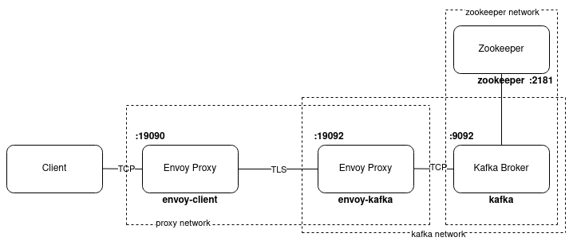
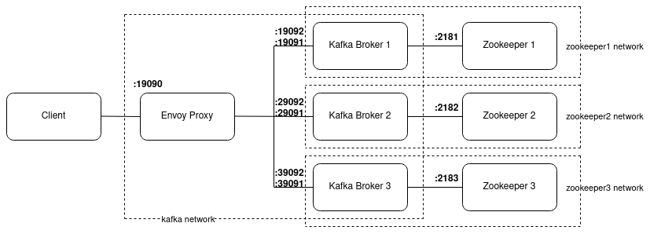
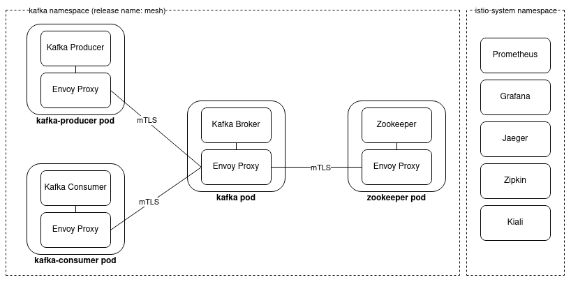

:toc:
:toc-title:
:toclevels: 2
:sectnums:
= Service Mesh and Proxies: Examples for Kafka

== Docker Examples
The examples at ./docker-examples can be run locally using Docker. They use https://www.envoyproxy.io/[Envoy] proxies with Kafka filters. Note that Kafka filters are an experimental feature and are only included in the contrib images of Envoy.

=== Prerequisites

- Docker and docker-compose

'''

=== Double-Proxy with TLS
When using a Service Mesh, this usually means that communication is routed via a double-proxy. https://istio.io/[Istio] automatically configures the sidecars and in simple use cases, no additional configuration is needed for the proxies. To get a better understanding of how the sidecars in Istio are configured, this double-proxy example builds the below architecture in Docker:

For routing, no Kafka filters are needed since this takes place at layer 4. Nevertheless, the https://www.envoyproxy.io/docs/envoy/latest/configuration/listeners/network_filters/kafka_broker_filter[Kafka Broker filter] can be applied additionally to make use of the metrics.

Istio also enables https://istio.io/latest/docs/tasks/security/authentication/mtls-migration/[automatic mTLS]. In Envoy, it is also possible to manually configure https://www.envoyproxy.io/docs/envoy/latest/api-v3/extensions/transport_sockets/tls/v3/common.proto.html?[TLS authentication]. In this example, the broker needs to authenticate against the client and therefore needs to provide certificates. Certificates and keys are mounted into the containers of the client proxy and the broker proxy.

The proxies re-route the requests to the configured ports. This functionality can also be used when the location of a service changed or should not be known.

The example can be executed using the following steps:

1) Change into the directory and start all containers:
-----
cd ./docker-examples/double-proxy-kafka-tls
docker-compose up -d
-----

2) Start an additional container as client to test the proxies:
-----
 docker run --rm -it --network host ueisele/apache-kafka-server:2.8.0 bash
-----

3) Test different commands using the tools kafka-topics, kafka-console-producer or kafka-console-consumer. The client proxy is available at localhost:19090. As an example:
-----
kafka-topics.sh --bootstrap-server localhost:19090 --list
-----

'''

=== Kafka Mesh Filter Example
The Kafka Mesh filter was https://github.com/envoyproxy/envoy/pull/11936[merged in September 2021] into Envoy's contrib image. It enables to use a single endpoint that proxies multiple clusters. The messages are forwarded by topic-prefixes. In this example, the prefixes a, b or c can be used.

The filter was developed by Adam Kotwasinski, who also mainly contributed to the Kafka Broker filter. He also published a detailed https://adam-kotwasinski.medium.com/kafka-mesh-filter-in-envoy-a70b3aefcdef[blog post] about it. The envoy configuration in this repository bases on his example in the article.

The docker-compose file builds the following setup:

Note that the Kafka Mesh filter can be combined with the Kafka Broker filter. In contrast to that, it is not possible to combine it with the TCP proxy filter! Nevertheless, the Kafka Mesh filter already enables basic routing to different clusters. Further constraints of this filter are described in the https://www.envoyproxy.io/docs/envoy/latest/configuration/listeners/network_filters/kafka_mesh_filter.html#notes[documentation].

To test this example, execute the below steps:

1) Change into the directory and start all containers:
-----
cd ./docker-examples/proxy-kafka-mesh
docker-compose up -d
-----

2) Create a Kafka client container to test the proxy:
-----
 docker run --rm -it --network host ueisele/apache-kafka-server:2.8.0 bash
-----

3) Produce some messages to different topics. Note that the Kafka Mesh filter only allows to produce messages, it is not possible to consume messages or to use functionalities of the kafka-topics tool! The proxy is available at localhost:19090. As topic prefixes, _a, b or c_ can be used. For example:
-----
kafka-console-producer.sh --bootstrap-server localhost:19090 --topic apples
> apple
> twoapples
-----
-----
kafka-console-producer.sh --bootstrap-server localhost:19090 --topic berries
> berry
> twoberries
-----
-----
kafka-console-producer.sh --bootstrap-server localhost:19090 --topic cherries
> cherry
> twocherries
-----

4) To test if the messages were delivered successfully, you can use the kafka-console-consumer tool. Since the Kafka Mesh filter can only be used for producing, the brokers need to be accessed without the proxy:
-----
kafka-console-consumer.sh --bootstrap-server localhost:19091 --topic apples --from-beginning
-----
-----
kafka-console-consumer.sh --bootstrap-server localhost:29091 --topic berries --from-beginning
-----
-----
kafka-console-consumer.sh --bootstrap-server localhost:39091 --topic cherries --from-beginning
-----

== Kubernetes Examples
The examples for Kubernetes show how to configure and use https://istio.io/[Istio] with Kafka. Since Istio automatically sets most of the required configuration, only small adjustments need to be done.

=== Prerequisites

- a local https://minikube.sigs.k8s.io/docs/start/[minikube] installation or access to a Kubernetes cluster
- installation of https://istio.io/latest/docs/setup/getting-started/[istioctl]

'''

=== Kafka Metrics in Istio
Currently, the functionalities of Istio are limited if it used with Kafka. The reason for this is that Istio mainly supports HTTP/HTTPS on layer 7. For the Kafka protocol, it is only possible to add metrics and to use layer 4 functionalities (e.g., mTLS).

To enable that the Prometheus metrics will be picked up by Istio, one important property is added to all pod configurations:

-----
template:
    metadata:
      annotations:
        proxy.istio.io/config: |-
          proxyStatsMatcher:
            inclusionRegexps:
            - ".*"
-----
This configures Istio proxy to record additional statistics. The regex expression can be adjusted for specific needs.
More details about this can be found in the official https://istio.io/latest/docs/ops/configuration/telemetry/envoy-stats/[documentation]. +
You can also use the collected Prometheus metrics to build your own Grafana dashboards.

The Istio will build the below environment:

1) Start minikube:
-----
minikube start
-----

2) Activate istio in your minikube kubernetes cluster:
-----
istioctl install --set profile=demo -y
-----

3) To activate monitoring tools, navigate to <istioctl-installation-directory>/samples. To install Kiali, Prometheus, Jaeger, Zipkin and Grafana:
-----
cd <istioctl-installation-directory>/samples
kubectl apply -f ./addons
-----

4) List all istio services to get an overview of the tools that can be used:
-----
kubectl get svc -n istio-system
-----
Note: It can take a few minutes until the services are fully available.

5) Port-forward the service you want to access:
-----
kubectl port-forward svc/kiali -n istio-system 20001
-----
The service can be accessed via your browser, e.g. http://localhost:20001 for Kiali.

6) Install Kafka, Zookeeper, Consumer and Producer:
-----
cd ./k8s-examples/k8s
./install.sh
-----
It can take a few seconds to minutes until all pods are in a running state.

7) Check the status of the pods. They can also be monitored using the tools used in step 5.
-----
kubectl get pods -n kafka
-----

'''

=== mTLS Authentication

Istio uses automatic mTLS which means that communication between the sidecars is automatically secured by mTLS. However, the default configuration for automatic mTLS is set to PERMISSIVE which means that mTLS will only be used if possible. In case one communication partner cannot use mTLS, unsecured communication will also be allowed. +
The authentication policy in ./k8s-examples/istio/istio-peer-authentication.yaml will set mTLS mode to STRICT.

Kiali should also display mTLS as enabled for the kafka namespace.  To test if mTLS works, you can deploy kafka-sample-other-namespace.yaml in another namespace where Istio is not (!) enabled. The pod will then not contain sidecars and containers will therefore not be able to communicate using mTLS. If the logs of
kafka-consumer or kafka-producer are examined, it will be visible that the communication will fail.

If the mTLS mode is changed to PERMISSIVE, communication with and without mTLS will be allowed again and producing/consuming will succeed. For more details, refer to the official https://github.com/istio/istio/issues/35336[documentation].

== Envoy Admin Interface in Docker and Istio
Envoy offers an admin interface which enables to access Envoy's logs.

*Docker:* +
To increase the log levels, the config has to be set when the container is running:

-----
docker exec -it <envoy-container-name> bash
apt-get update
apt-get install curl
curl -X POST localhost:9901/logging?level=debug
-----

*Istio:* +

-----
kubectl exec -it <pod-name> -c istio-proxy -n kafka -- /bin/bash
curl -X GET localhost:15000/stats
# for increased log level:
curl -X POST localhost:15000/logging?level=DEBUG
-----

Find https://www.envoyproxy.io/docs/envoy/latest/operations/admin[further details about the admin interface] and its functionalities.

== Envoy Contrib Images
Envoy moved experimental filters to a separate Docker image in release 1.20. For Istio, this means that some filters can only be used when Istio version 1.11 is used. Istio version 1.12 will already include Envoy 1.20 and therefore only officially supported features. On https://github.com/istio/istio/issues/35336[Github], it is already discussed whether Istio should maintain official and contrib images.

== References and Further Resources
To build these examples, mainly the following references were used:

- https://github.com/aeraki-framework/kafka-zookeeper-envoyfilter-example[Github: Istio-Kafka-Zookeeper-Example by Huabing Zhao]
- https://adam-kotwasinski.medium.com/kafka-mesh-filter-in-envoy-a70b3aefcdef[Medium: Blog Post on Kafka Mesh Filter by Adam Kotwasinski]
- https://adam-kotwasinski.medium.com/deploying-envoy-and-kafka-8aa7513ec0a0[Medium: Blog Post on Kafka Broker Filter by Adam Kotwasinski]
- https://github.com/adamkotwasinski/envoy-kafka-mesh-test[Github: Kafka Mesh Filter Repository by Adam Kotwasinski]
- https://www.envoyproxy.io/docs/envoy/latest/configuration/listeners/network_filters/kafka_broker_filter.html[Envoy Documentation: Kafka Broker Filter]
- https://www.envoyproxy.io/docs/envoy/latest/configuration/listeners/network_filters/kafka_mesh_filter[Envoy Documentation: Kafka Mesh Filter]
- https://www.envoyproxy.io/docs/envoy/latest/intro/arch_overview/security/ssl[Envoy Documentation: TLS configuration]
- https://www.envoyproxy.io/docs/envoy/latest/start/sandboxes/double-proxy[Envoy Documentation: Double-Proxy Example]

For more information about Kafka, Istio and Service Meshes, consider these articles and videos:

- https://www.youtube.com/watch?v=Fi292CqOm8A[YouTube: Presentation "Kafka and the Service Mesh" by Gwen Shapira, Confluent]
- https://www.confluent.de/resources/white-paper/confluent-and-istio-service-mesh/[Confluent Whitepaper: Confluent and Istio Service Mesh]
- https://itnext.io/scalable-microservice-demo-k8s-istio-kafka-344a2610eba3[Medium: Scalable Microservice Demo with K8, Istio, and Kafka]
- https://www.youtube.com/watch?v=voAyroDb6xk[YouTube: Istio Setup]
- https://www.youtube.com/watch?v=16fgzklcF7Y[YouTube: Istio and Service Mesh explained]
- https://www.infoq.com/articles/service-mesh-event-driven-messaging/[InfoQ Blog: The Potential of Using a Service Mesh for Event-Driven Messaging]
- https://www.redhat.com/en/topics/microservices/what-is-a-service-mesh[Redhat: What is a Service Mesh?]
- https://ieeexplore.ieee.org/abstract/document/8705911[IEEE: Service Mesh: Challenges, State of the Art, and Future Research Opportunities]
- https://www.kai-waehner.de/blog/2019/09/24/cloud-native-apache-kafka-kubernetes-envoy-istio-linkerd-service-mesh/[Kai Waehner: Service Mesh and Cloud-Native Microservices with Apache Kafka, Kubernetes, and Envoy, Istio, Linkerd]

'''

=== Aeraki Framework
As already explained above, Istio currently mainly supports HTTP/HTTPS. But there are many other protocols were the functionalities of Istio would be beneficial. To support a new protocol, it is currently necessary to implement new filters for Envoy. https://github.com/aeraki-framework/aeraki[Aeraki framework] aims to make this process easier for other layer 7 protocols in Istio.

At the moment, Aeraki provides the most benefits for Dubbo and Thrift protocol. Nevertheless, the project seems to be under active development and aims to support more protocols in the future. It is also possible to implement an interface to add new filter functionalities.

However, for Kafka, Aeraki currently only supports metrics which is already easy to configure without Aeraki.

